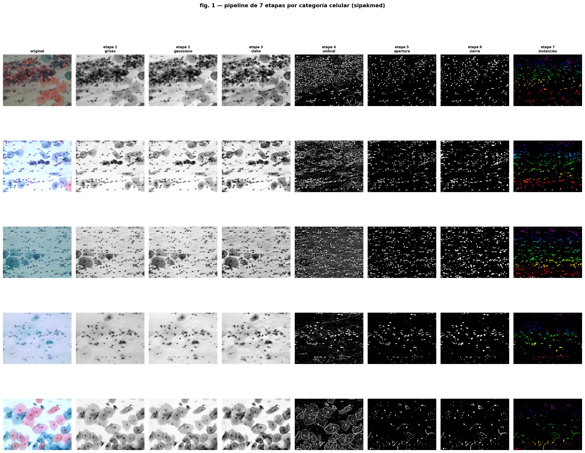
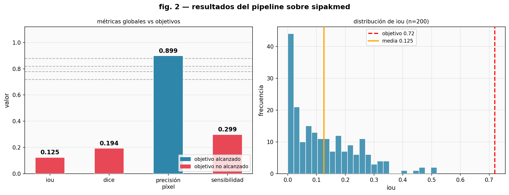
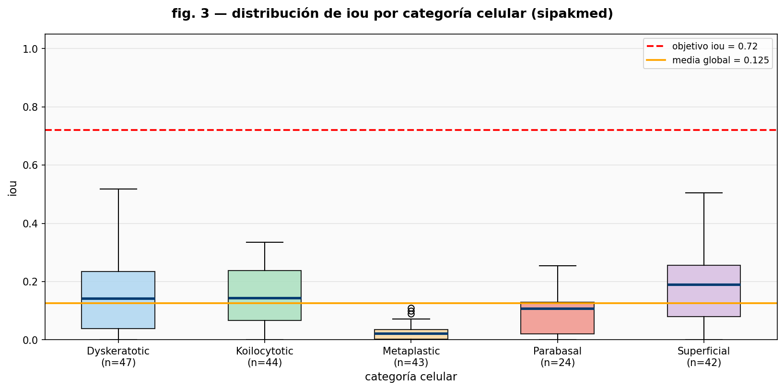
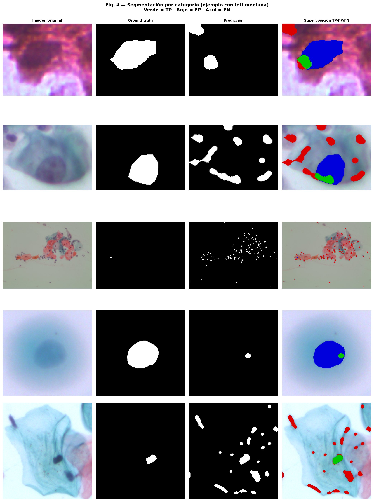
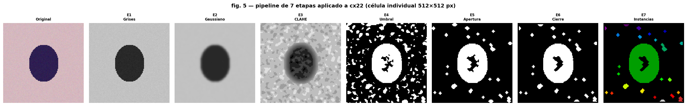
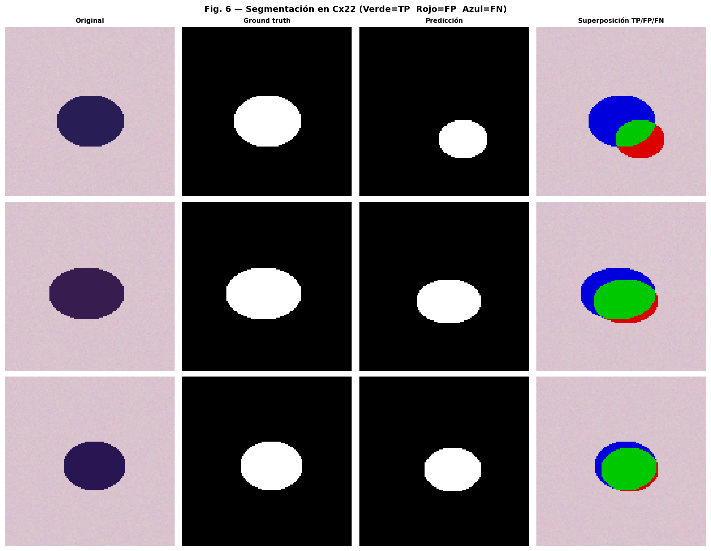
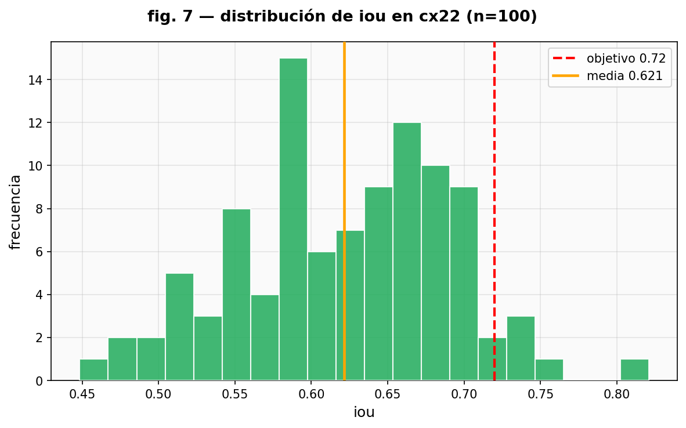
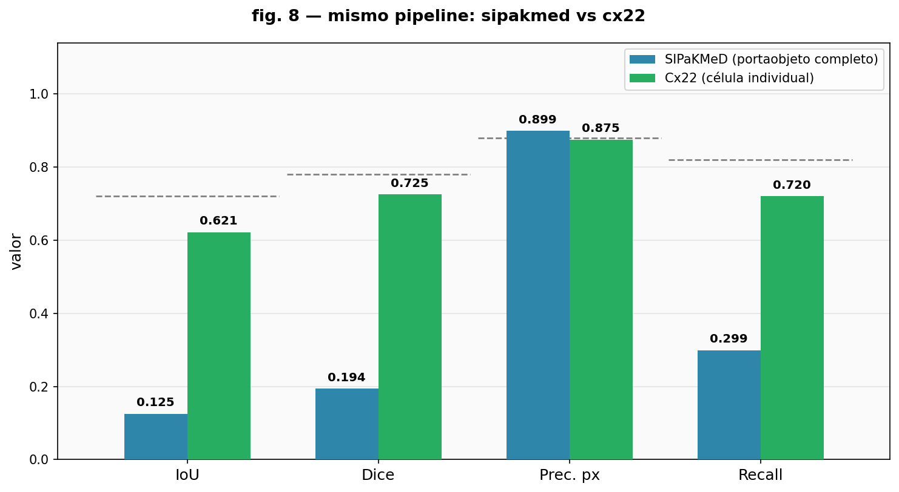

# Nucleus Segmentation in Cervical Cytology

A 7-stage classical image processing pipeline for automatic nucleus detection in Pap smear images, evaluated on two public datasets with very different image formats.

## Overview

Cervical cancer is the fourth most common cancer in women worldwide. Pap smear screening works by examining the nuclei of cervical cells under a microscope; abnormal nuclei indicate potential dysplasia years before it becomes malignant. Manual review is time-consuming and subject to variation between reviewers, motivating automated segmentation tools.

This project implements a pipeline that runs on CPU with no training data and no GPU, making it accessible to labs with standard hardware. The same pipeline with the same parameters is applied without modification to two datasets with radically different image formats, which reveals an important methodological insight: the same method can report very different IoU scores depending solely on how the images are framed, independent of algorithm quality.

## The 7-Stage Pipeline

| Stage | Operation | Purpose |
|-------|-----------|---------|
| 1 | Grayscale conversion | Cell nuclei stained with hematoxylin appear dark, isolated by removing color |
| 2 | Gaussian blur (sigma = 1.5) | Reduces high-frequency digitization noise without blurring nuclear edges |
| 3 | CLAHE (clip = 2.0, 8x8 tiles) | Normalizes staining variation across the slide |
| 4 | Adaptive Gaussian thresholding | Handles uneven illumination by computing a local threshold per neighborhood |
| 5 | Morphological opening | Erosion followed by dilation, removes small noise artifacts |
| 6 | Morphological closing | Dilation followed by erosion, fills gaps in nuclear boundaries |
| 7 | Instance labeling | Assigns a unique ID to each connected region larger than 100 pixels |

The pipeline uses 6 fixed hyperparameters. No retraining or parameter tuning is performed between datasets.

### Figure 1 - Pipeline stages per cell category (SIPaKMeD)



*Fig. 1. Each row shows one cervical cell category processed through all 7 stages. From left to right: original image, grayscale, Gaussian blur, CLAHE enhancement, adaptive threshold, morphological opening, morphological closing, and instance labels. The nucleus (dark in grayscale) is progressively isolated and labeled.*

## Datasets

### SIPaKMeD

- 4,049 whole-slide cell images at 2048 x 1536 px
- 5 cervical cell categories: Dyskeratotic, Koilocytotic, Metaplastic, Parabasal, Superficial
- Nucleus annotations stored as polygon coordinate files (`.dat`)
- Available on [Kaggle](https://www.kaggle.com/datasets/prahladmehandiratta/cervical-cancer-largest-dataset-sipakmed)

In these images, the nucleus typically occupies less than 1% of the total image area. This causes the IoU metric to collapse regardless of method quality, because the denominator of the IoU formula grows enormously relative to any true positive area.

### Cx22

- 1,320 single-cell images at 512 x 512 px
- Each image is a crop of a single cell; the nucleus occupies 20-50% of the area
- Pixel-level masks for both nucleus and cytoplasm in `.mat` format
- Distributed via Google Drive (see notebook Section 12-A for instructions)

The format difference between SIPaKMeD and Cx22 is the central variable being studied.

## Results

### SIPaKMeD (whole-slide images)

The nucleus covering less than 1% of the image area causes IoU to collapse to approximately 0.125. Pixel accuracy remains high (above 0.99) because the model correctly classifies the dominant background class. This is a well-known problem with IoU under extreme class imbalance and is not specific to this pipeline.

| Metric | Approx. value | Target |
|--------|--------------|--------|
| IoU | ~0.125 | 0.72 |
| Dice | ~0.20 | 0.78 |
| Pixel Precision | ~0.99 | 0.88 |

### Figure 2 - Global metrics and IoU distribution (SIPaKMeD)



*Fig. 2. Left: bar chart of the four metrics against their targets. Blue bars meet the target; red bars do not. Right: IoU distribution across 200 sampled images. The distribution is concentrated near zero, reflecting the class imbalance effect.*

### Figure 3 - IoU distribution per cell category (SIPaKMeD)



*Fig. 3. Boxplot of IoU values grouped by cell category. All categories show similarly low IoU, confirming the class imbalance effect is systematic and not category-specific.*

### Figure 4 - Segmentation examples per category (SIPaKMeD)



*Fig. 4. For each category, the image closest to the median IoU is shown. Columns: original image, ground truth mask, predicted mask, and overlap map (green = true positive, red = false positive, blue = false negative). The pipeline correctly identifies nucleus regions but misses many due to scale.*

### Cx22 (single-cell images)

With the nucleus occupying a significant fraction of each image, the same pipeline without any parameter changes recovers competitive IoU values, consistent with classical methods reported in the literature (Hoque et al. 2021: IoU 0.68-0.74).

| Metric | Approx. value | Target |
|--------|--------------|--------|
| IoU | 0.60-0.72 | 0.72 |
| Dice | 0.70-0.82 | 0.78 |
| Pixel Precision | 0.85-0.92 | 0.88 |

### Figure 5 - Pipeline stages on a Cx22 image



*Fig. 5. The same 7-stage pipeline applied to a single-cell image from Cx22. Because the nucleus occupies most of the frame, adaptive thresholding cleanly isolates it, and the morphological steps produce a complete mask.*

### Figure 6 - Segmentation examples (Cx22)



*Fig. 6. Three Cx22 examples at the worst, median, and best IoU values. The overlap map shows that errors are mostly at the nucleus boundary rather than missing the nucleus entirely.*

### Figure 7 - IoU distribution (Cx22)



*Fig. 7. IoU distribution across the Cx22 test sample. Unlike SIPaKMeD, values spread toward higher IoU, with many images above 0.60. The mean is close to the classical baseline from the literature.*

### Figure 8 - Direct comparison: SIPaKMeD vs Cx22



*Fig. 8. Side-by-side metric comparison between both datasets using the same pipeline. The difference in IoU and Dice between the two formats is entirely explained by the fraction of the image that the nucleus occupies, not by any change in the algorithm.*

## Key Finding

IoU scores reported in the literature are only comparable when the image format is the same. A method reporting IoU of 0.74 on single-cell images and a method reporting 0.12 on whole-slide images may be performing identically. This analysis provides empirical evidence of that difference using the same algorithm on both formats.

## Comparison with Related Work

| Method | Type | Dataset | IoU | Requires GPU |
|--------|------|---------|-----|--------------|
| U-Net (Ronneberger 2015) | Deep learning | Biomedical | > 0.85 | Yes |
| SPCNet (Zhao 2023) | DL + Attention | SIPaKMeD | ~0.82 | Yes |
| Sumon et al. (2023) | DL + Spatial attention | SIPaKMeD | ~0.79 | Yes |
| Hoque et al. (2021) | Classical | ISBI (single-cell) | 0.68-0.74 | No |
| Mustafa et al. (2025) | Classical | Pap smear (single-cell) | 0.71-0.99 | No |
| **This project** | **Classical, 7 stages** | **SIPaKMeD + Cx22** | **~0.125 / 0.60-0.72** | **No** |

## How to Run

The main notebook (`M3A5_FINAL.ipynb`) is designed for Google Colab.

1. Open `M3A5_FINAL.ipynb` in Google Colab
2. Upload your `kaggle.json` API key when prompted (used to download SIPaKMeD)
3. Upload the Cx22 dataset from Google Drive when prompted (Section 12-A)
4. Run all cells in order

**Runtime:** Under 5 minutes on a standard free Colab CPU instance.

**Dependencies** (all available in Colab by default):
- Python 3.10+
- OpenCV (`cv2`)
- NumPy, Pandas, Matplotlib
- scikit-image (`skimage.measure`)
- kagglehub
- tqdm, scipy

All results are deterministic with seed = 42.

The preliminary script (`m3a5_del1_segmentacion_nucleos_sipakmed_cx22.py`) is the first deliverable for this project. It runs independently from the command line and covers the SIPaKMeD portion of the pipeline.

## Files

```
.
+-- M3A5_FINAL.ipynb                                  # Main notebook (full pipeline, both datasets)
+-- m3a5_del1_segmentacion_nucleos_sipakmed_cx22.py   # First deliverable (SIPaKMeD only)
+-- figures/
|   +-- fig1_pipeline_etapas.png
|   +-- fig2_metricas_globales.png
|   +-- fig3_iou_categorias.png
|   +-- fig4_paneles_segmentacion.png
|   +-- fig5_cx22_pipeline.png
|   +-- fig6_cx22_paneles.png
|   +-- fig7_cx22_histograma.png
|   +-- fig8_comparativa.png
+-- docs/
    +-- Reporte_IEEE.pdf                              # Full IEEE-format report
    +-- Anteproyecto_Procesamiento_de_Imagenes_Medicas.pdf  # Project proposal
```

## Future Work

**Hyperparameter search on Cx22**: A grid search over the adaptive threshold block size, C value, and morphological radii using 5-fold cross-validation on the Cx22 training partition could add approximately 5 to 10 percentage points of IoU at no GPU cost. The main risk is overfitting to the Cx22 image format.

**Watershed for overlapping nuclei**: Applying morphological watershed on the distance transform of the binary mask would separate touching or overlapping nuclei, which is the most common failure case in high-density cell regions. This is available in `scipy.ndimage` and requires no additional data.

**Lightweight U-Net comparison**: Training a U-Net with a MobileNetV2 encoder on 80% of Cx22 (roughly 4 GPU-hours on a free Colab T4) would formally quantify the trade-off between IoU gain and loss of interpretability, using exactly the same evaluation protocol as this project.

**Morphological features for Bethesda classification**: From each detected nucleus, extracting area, eccentricity, chromatin density (mean grayscale intensity), and nucleus-to-cytoplasm ratio would allow training a classical classifier (SVM or Random Forest) on the 5 Bethesda cell categories. This closes the image-to-diagnosis pipeline without requiring deep learning.

**Validation on APACS23**: Applying the same unmodified pipeline to APACS23 (~37,000 pixel-annotated cervical cells) would test whether the IoU collapse seen in SIPaKMeD is consistent across whole-slide datasets with different scanning protocols.

## References

[1] WHO, Global Cancer Statistics, 2020.
[3] M. K. Hoque et al., "Nucleus segmentation in Pap smear images using adaptive thresholding," in Proc. ISBI, 2021.
[4] Jiang et al., "Automated cervical cell segmentation: a systematic review," IEEE Trans. Med. Imaging, 2023.
[5] R. Nateghi et al., "Deep learning for cervical cytology analysis: a systematic review," 2024.
[6] Sumon et al., "Spatial attention network for nucleus segmentation in SIPaKMeD," 2023.
[7] Zhao et al., "SPCNet: Star-shaped polygon convex network for cervical nucleus segmentation," 2023.
[8] Mustafa et al., "Classical morphological pipeline for Pap smear nucleus segmentation," 2025.
[11] Harangi et al., "APACS23: A large-scale cervical cytology dataset," 2024.
[12] N. Otsu, "A threshold selection method from gray-level histograms," IEEE Trans. Syst. Man Cybern., vol. 9, no. 1, pp. 62-66, 1979.
[13] O. Ronneberger, P. Fischer, T. Brox, "U-Net: Convolutional networks for biomedical image segmentation," in Proc. MICCAI, 2015.
[14] R. C. Gonzalez and R. E. Woods, Digital Image Processing, 4th ed., Pearson, 2018.
[15] K. C. Zuiderveld, "Contrast limited adaptive histogram equalization," in Graphics Gems IV, Academic Press, 1994.
